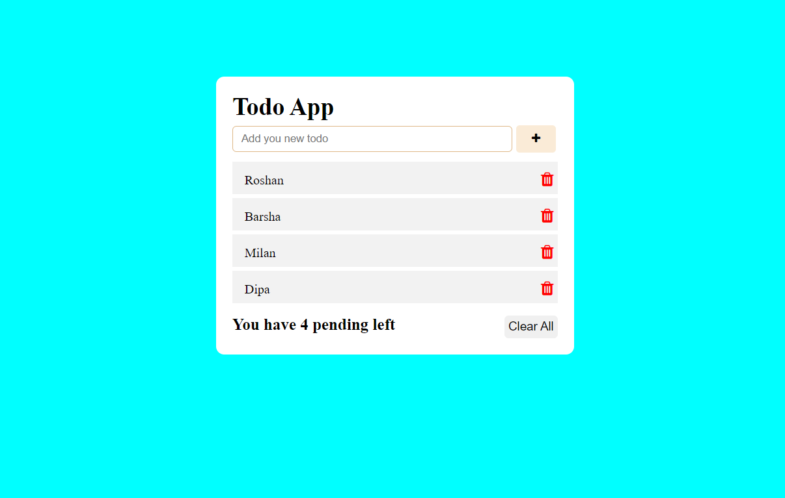

<a name="readme-top"></a>

<!--
HOW TO USE:
This is an example of how you may give instructions on setting up your project locally.

Modify this file to match your project and remove sections that don't apply.

REQUIRED SECTIONS:
- Table of Contents
- About the Project
  - Built With
  - Live Demo
- Getting Started
- Authors
- Future Features
- Contributing
- Show your support
- Acknowledgements
- License

After you're finished please remove all the comments and instructions!
-->

<div align="center">

  
  <br/>

  <h3><b>Microverse README Template</b></h3>

</div>

<!-- TABLE OF CONTENTS -->

# 📗 Table of Contents

- [📖 About the Project](#about-project)
  - [🛠 Built With](#built-with)
    - [Tech Stack](#tech-stack)
    - [Key Features](#key-features)
  - [🚀 Live Demo](#live-demo)
- [💻 Getting Started](#getting-started)
  - [Setup](#setup)
  - [Prerequisites](#prerequisites)
  - [Install](#install)
  - [Usage](#usage)
  - [Run tests](#run-tests)
  - [Deployment](#triangular_flag_on_post-deployment)
- [👥 Authors](#authors)
- [🔭 Future Features](#future-features)
- [🤝 Contributing](#contributing)
- [⭐️ Show your support](#support)
- [🙏 Acknowledgements](#acknowledgements)
- [❓ FAQ](#faq)
- [📝 License](#license)

<!-- PROJECT DESCRIPTION -->

# 📖 Todo App <a name="about-project"></a>



## 🛠 Built With <a name="built-with">HTML, CSS and Javascript</a>


<!-- Features -->

### Key Features <a name="key-features"></a>

<!-- LIVE DEMO -->

## 🚀 Live Demo <a name="live-demo"></a>

- [Live Demo Link](https://inspiring-lebkuchen-150cfd.netlify.app)

<!-- GETTING STARTED -->

## 💻 Getting Started <a name="getting-started"></a>

> Describe how a new developer could make use of your project.

To get a local copy up and running, follow these steps.

### Prerequisites

In order to run this project you need:

<!--
Example command:

```sh
 gem install rails
```
 -->

### Setup

Clone this repository to your desired folder:

<!--
Example commands:

```sh
  cd my-folder
  git clone git@github.com:myaccount/my-project.git
```
--->

### Install

Install this project with: `git clone` `git@github.com:roshan-bajgain/Todos_app.git`

<!--
Example command:

```sh
  cd my-project
  gem install
```
--->

### Usage

To run the project, execute the following command:
`run the live server`

<!--
Example command:

```sh
  rails server
```
--->


### Deployment

You can deploy this project using: `Netlify`

<!--
Example:

```sh

```
 -->


<!-- AUTHORS -->

## 👥 Authors <a name="authors"></a>


👤 **Author1**

- GitHub: [@roshan-bajgain](https://github.com/roshan-bajgain)
- Twitter: [@RoshanBajgain10](https://twitter.com/RoshanBajgain10)
- LinkedIn: [LinkedIn](https://www.linkedin.com/in/roshan-bazgain/)


<!-- CONTRIBUTING -->

## 🤝 Contributing <a name="contributing"></a>

Contributions, issues, and feature requests are welcome!

Feel free to check the [issues page](https://github.com/roshan-bajgain/Todos_app/issues).


<!-- SUPPORT -->

## ⭐️ Show your support <a name="support"></a>

> If you like this project...please give⭐️ Thank you


<!-- ACKNOWLEDGEMENTS -->

## 🙏 Acknowledgments <a name="acknowledgements"></a>

> Give credit to everyone who inspired your codebase.

I would like to thank...


<!-- FAQ (optional) -->


<!-- LICENSE -->

## 📝 License <a name="license"></a>

This project is [MIT](./LICENSE) licensed.

_NOTE: we recommend using the [MIT license](https://choosealicense.com/licenses/mit/) - you can set it up quickly by [using templates available on GitHub](https://docs.github.com/en/communities/setting-up-your-project-for-healthy-contributions/adding-a-license-to-a-repository). You can also use [any other license](https://choosealicense.com/licenses/) if you wish._

<p align="right">(<a href="#readme-top">back to top</a>)</p>
